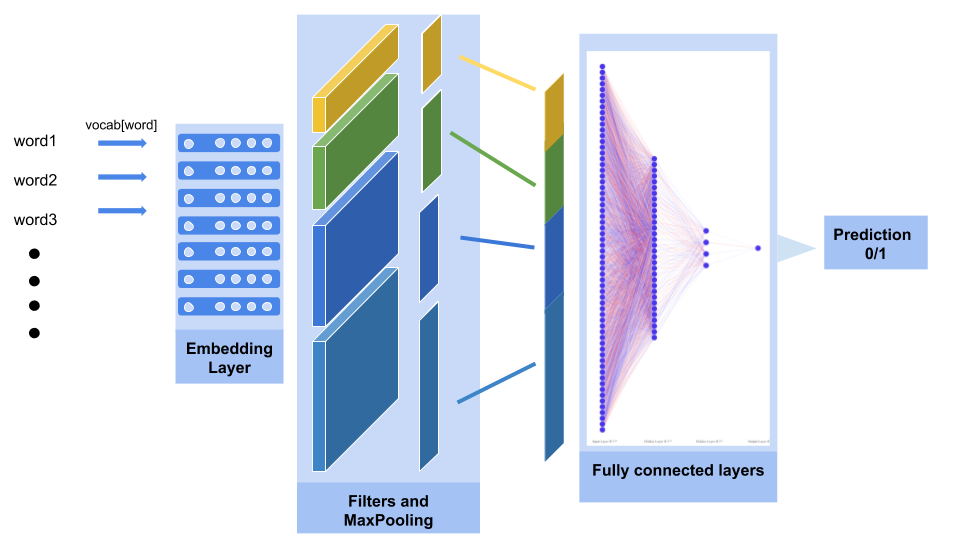
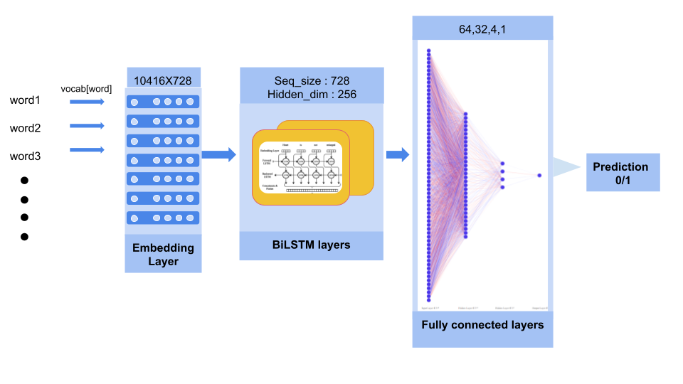
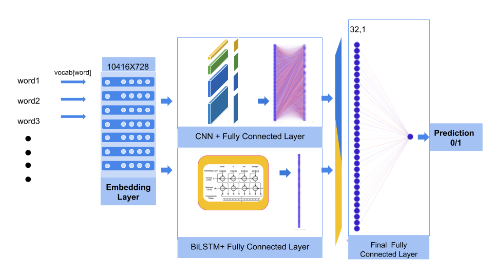
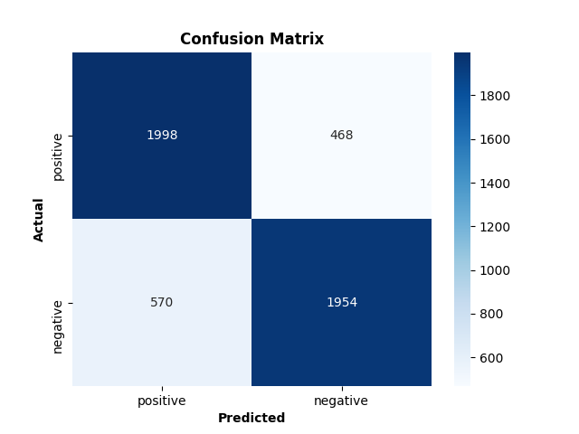
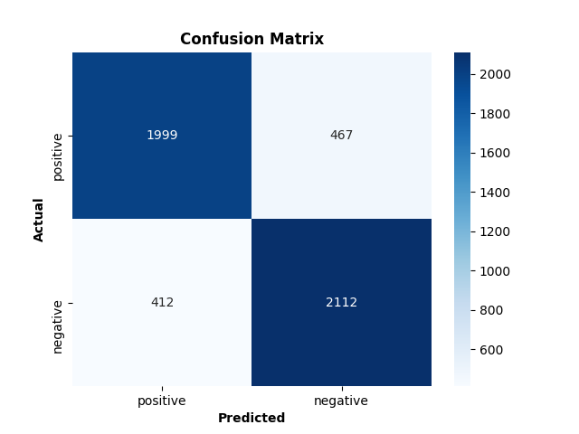

# Tweet Sentiment Classification

<!--[](https://www.python.org/)-->
<!-- for badges visit : https://github.com/alexandresanlim/Badges4-README.md-Profile-->

[](https://www.python.org/)
[](https://pytorch.org/)

---

This repo contains Python implementation of Sentiment Analysis of Tweets using Neural Networks with Pytorch.

## Overview

- Framework used : Pytorch
- Architectures : LSTM,CNN(2D), and a hybrid of these two
- Dataset : [Sentiment140](http://help.sentiment140.com/for-students/)
- Final accuracy : 82.157433 %
- [Report](docs/Sentiment_Analysis_Report.pdf)

### Scripts

- Preprocessing : [ setup_dataset.py ](main/setup_dataset.py)
- Embedding Training : [ train_embedding.py ](main/train_embedding.py)
- Hybrid Model Training : [ train_hybrid.py ](main/train_hybrid.py)

## #Architectures :

### CNN based Model



### LSTM based Model



### Hybrid Model



## #Results

### Accuracy

- CNN based model : 79.28%
- LSTM based model : 82.5%
- Hybrid Model : 82.15%

### Confusion Matrices

- For cnn based model

  

- For LSTM based model

  

- For hybrid model

  

# References

---

- Dataset

```
@ONLINE {Sentiment140,
    author = "Go, Alec and Bhayani, Richa and Huang, Lei",
    title  = "Twitter Sentiment Classification using Distant Supervision",
    year   = "2009",
    url    = "http://help.sentiment140.com/home"
}
```
